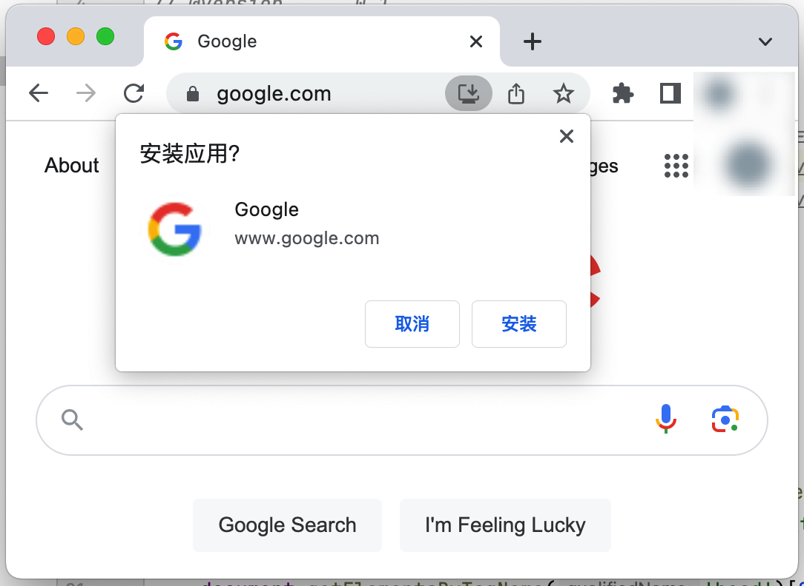

# WebAppify

> Make any website an installable PWA.

## Installation

- Install Greasemonkey / TemperMonkey (or any other alternatives)
- [Click here](https://github.com/NoCLin/WebAppify/raw/master/WebAppify.user.js)

## Steps

1. Open context menu (right-click)
2. Select TemperMonkey / TemperMonkey (or any other alternatives) -> WebAppify -> Install as PWA
3. Locate the installation button on the right-hand side of the address bar

## Highlights

- insert manifest
- Retrieve the icon and resize it to 512x512 in browser.
- build Base64 URL (No need to worry about CORS or CSP)
