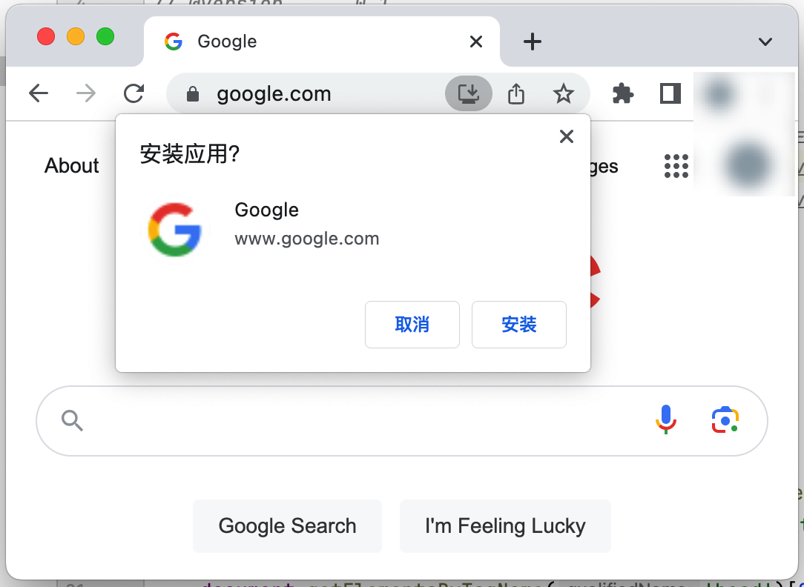
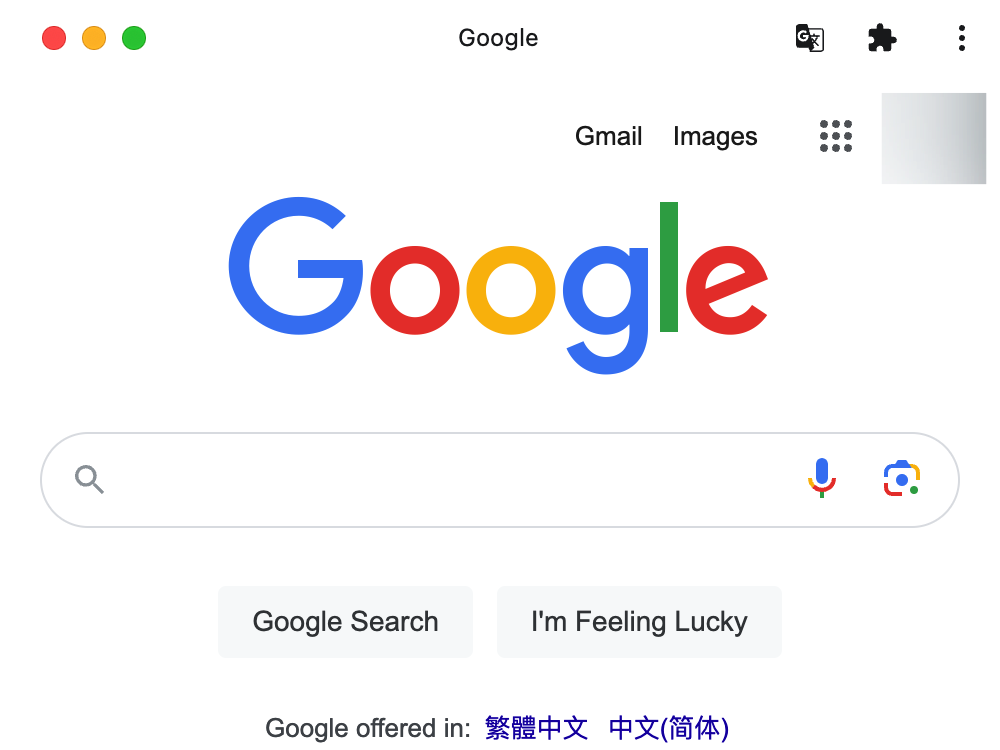
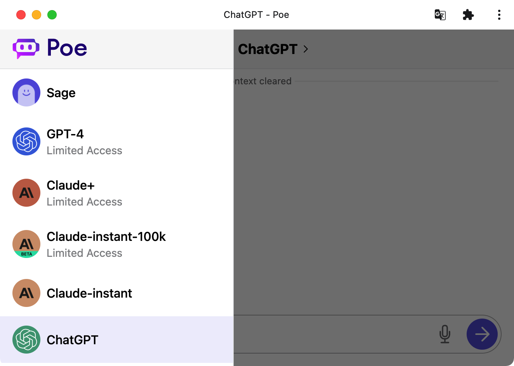
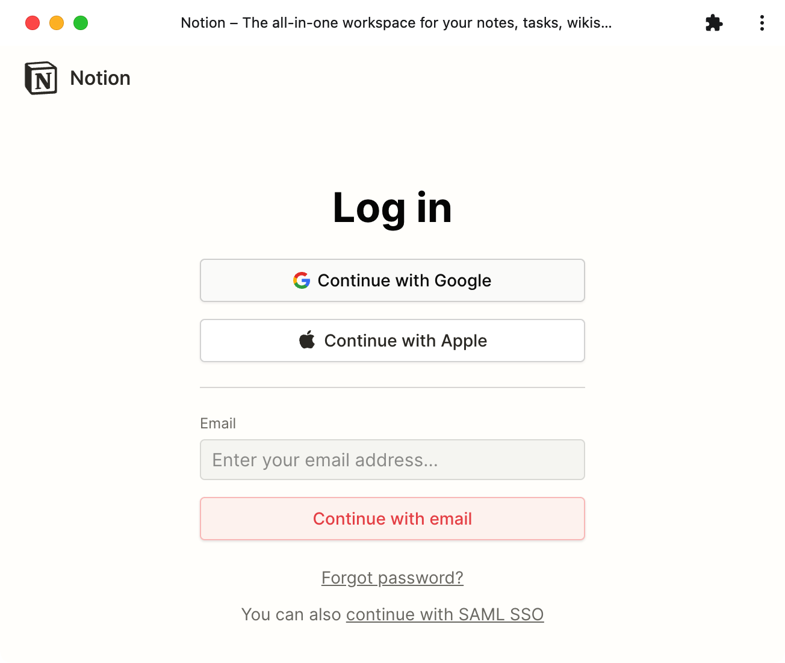

# WebAppify

> Make any website an installable PWA, **regardless of whether or not the website owner has provided one**.

|          |          |
|----------|----------|
|  |  |
|      |  |

Known limitations:

- Tested on Chrome + HTTPS sites only. The feature is integrated within **Microsoft Edge by default**. [screenshot](https://smms.app/image/ijqGShcCwoWmnBT)
- [Firefox](https://www.reddit.com/r/firefox/comments/uwojh7/why_did_firefox_kill_pwa_support/) and Safari are not supported.
- Some websites may still be impacted by CSP and unable to load resources.

## Installation

- Install
[Tampermonkey](https://chrome.google.com/webstore/detail/tampermonkey/dhdgffkkebhmkfjojejmpbldmpobfkfo) /
[Violentmonkey](https://chrome.google.com/webstore/detail/violentmonkey/jinjaccalgkegednnccohejagnlnfdag)
 (or any other alternatives)
- [Click here to install](https://github.com/NoCLin/WebAppify/raw/master/WebAppify.user.js)

## Steps

1. Open the context menu by right-clicking
2. Select Tampermonkey / Greasemonkey (or any other alternatives) -> WebAppify -> Install as PWA
3. Locate the installation button on the right-hand side of the address bar

## Highlights

- insert manifest
- Retrieve the icon and resize it to 512x512 in browser.
- build Base64 URL (No need to worry about CORS or CSP)
